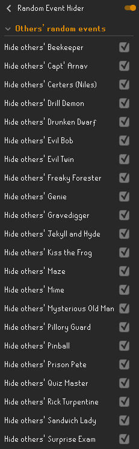
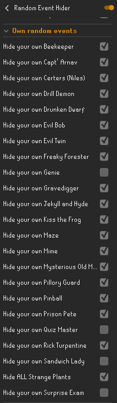

# Random Event Hider
Also annoyed by those pesky random events? **This plugin adds the ability to hide specific random events.** You can hide your own and/or other players' random events on a per random event basis. That way you can hide the events, but you won't miss your free agility experience or stale baguette!

It is recommended to disable "Random Events" in the default Entity Hider plugin if you wish specific random events to be visible.

As can be seen in the example config below, this plugin allows for more customizability than the default Entity Hider plugin. 
For example, hiding all random events except your own Genie, Quiz Master, Sandwich Lady and Surprise Exam:

 

If you experience any issues or have any concerns, please reach out to YvesW via a GitHub Issue, by Discord direct messaging or via the RuneLite Discord by mentioning @Yves W.

Thanks to Annex/Desaus for the suggestion!