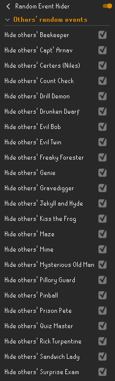
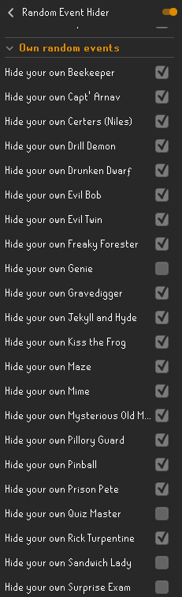
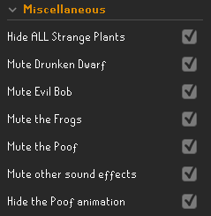

# Random Event Hider
Also annoyed by those pesky random events? **This plugin adds the ability to hide specific random events.** You can hide your own and/or other players' random events on a per random event basis. That way you can hide the events, but you won't miss your free agility experience or stale baguette!

*It is recommended to disable "Random Events" and "Hide Attackers" in the default Entity Hider plugin if you wish specific random events to be visible.*

**This plugin adds the following features:**
- Hide your own or others' random events on a per event and per interaction basis, including the Strange Plant. Don't miss out on your own Lamps, Books of knowledge and Stale baguettes!
- Mute sounds made by random events, such as Evil Bob's meow/hiss, the Drunken Dwarf, and the Frogs.
- Hide the 'Poof' smoke animation created by random events.
- Hide others' messengers (Regicide, The Frozen Door, and Into the Tombs).

As can be seen in the example config below, this plugin allows for more customizability than the default Entity Hider plugin. 
For example, hiding all random events except your own Count Check, Genie, Quiz Master, Sandwich Lady and Surprise Exam:

 
 

If you experience any issues or have any concerns, please reach out to YvesW via a GitHub Issue, by Discord direct messaging or via the RuneLite Discord by mentioning @``YvesW``.

Thanks to Annex/Desaus for the suggestion!

## Changelog
11-2023:
- Added support for Count Check.

09-2023:
- Added a config option to hide other's messengers (see 'Miscellaneous').

05-2023:
- Added a config option to mute the splashes of the frogs (see 'Miscellaneous').

01-2023: among others...
- Added muting sounds made by random events.
- Added hiding the 'Poof' smoke GraphicsObject created by random events.
- Added the 'Miscellaneous' category in the config panel.
- Moved 'Hide ALL Strange Plants' config option.
- Fixed random events not being hidden in specific instances such as the POH.